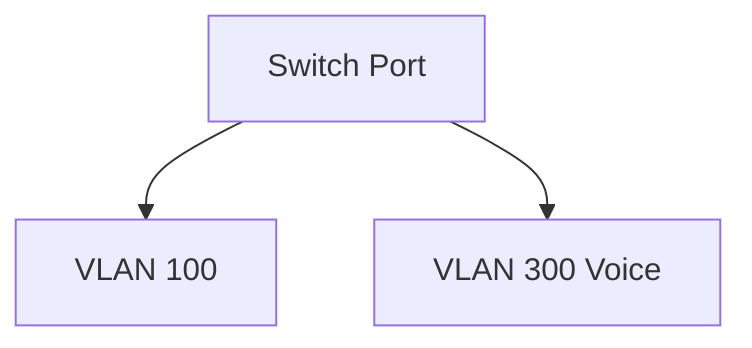

# Wiki System - Architektur & Features

## System-Überblick

Das Wiki System ist eine moderne, vollständig typisierte Web-Anwendung für Dokumentation und Wissensmanagement.

### Technologie-Stack

**Frontend:**
- React 18 + TypeScript + Vite
- Tailwind CSS + shadcn/ui Komponenten
- React Router v6 für Navigation
- Zustand für State Management
- React Query für API-Caching
- React Markdown + Mermaid für Content-Rendering
- Monaco Editor für Code-Bearbeitung

**Backend:**
- Node.js + NestJS + TypeScript
- PostgreSQL + Prisma ORM
- JWT Authentication + Refresh Tokens
- Passport.js für Auth-Strategien
- Multer für File Uploads
- Helmet für Security Headers
- Rate Limiting & Input Validation

**Infrastructure:**
- Docker + Docker Compose
- Nginx Reverse Proxy
- PostgreSQL Database
- Redis für Caching (optional)

## Kern-Features

### 1. Authentifizierung & Autorisierung

**Rollen-System (RBAC):**
- **Admin:** Vollzugriff auf alle Funktionen und Einstellungen
- **Editor:** Kann Spaces und Seiten erstellen/bearbeiten, Reviews durchführen
- **Viewer:** Nur Lesezugriff, kann kommentieren
- **Gast:** Nur öffentlich freigegebene Inhalte (optional)

**Sicherheits-Features:**
- JWT Access Tokens (15min) + Refresh Tokens (7 Tage)
- Argon2id Password Hashing
- Rate Limiting für Login & API-Calls
- CSRF-Schutz & Content Security Policy
- HttpOnly Cookies für Refresh Tokens

### 2. Spaces & Organizational Structure

**Space-Konzept:**
- Logische Gruppierung von verwandten Seiten
- Verschiedene Sichtbarkeitsebenen (private/internal/public)
- Team-basierte Zugriffskontrolle
- Hierarchische Navigation

**Beispiel-Spaces:**
- Infrastruktur (Netzwerk, Server, Hardware)
- HowTos (Tutorials, Anleitungen)
- Projekte (Testlab, SPIE Wetter)
- Guidelines (Sicherheit, Best Practices)

### 3. Content Management

**Markdown-basierte Seiten:**
- GitHub Flavored Markdown Support
- Live-Preview beim Bearbeiten
- Frontmatter für Metadaten
- Code-Syntax-Highlighting
- Mermaid-Diagramm-Support
- Mathematische Formeln (KaTeX)

**Beispiel-Seite mit Features:**
```markdown
---
title: "VLAN-Konfiguration Aruba 2930F"
tags: ["Netzwerk", "Aruba", "VLAN"]
status: "published"
owner: "netzwerk-team"
---

# VLAN-Konfiguration

## Grundkonfiguration

```bash
configure
vlan 100
  name "Benutzer"
  exit
```

## Netzwerk-Diagramm



> **Wichtig:** Nach Konfiguration `write memory` ausführen!
```

### 4. Versionierung & Review-Workflow

**Vollständige Versionshistorie:**
- Jede Änderung wird versioniert
- Diff-Ansicht zwischen Versionen
- Rollback zu früheren Versionen
- Autor-Tracking für alle Änderungen

**Review-System:**
- Draft → Review → Published Workflow
- 4-Augen-Prinzip (Reviewer ≠ Autor)
- Approve/Request Changes mit Kommentaren
- E-Mail-Benachrichtigungen

### 5. Suche & Navigation

**Volltext-Suche:**
- PostgreSQL Full-Text Search
- Suche in Titel, Inhalt und Tags
- Relevanz-basierte Sortierung
- Snippet-Hervorhebung in Ergebnissen
- Filter nach Space, Tag, Status

**Navigation:**
- Sidebar mit Spaces & Tags
- Breadcrumb-Navigation
- Auto-generiertes Inhaltsverzeichnis
- "Zuletzt bearbeitet" Listen
- Keyboard Shortcuts (Ctrl+K für Omnibox)

### 6. File Management

**Attachment-System:**
- Drag & Drop Upload
- Sicherer Download mit Access-Control
- Unterstützte Formate: Bilder, PDFs, Dokumente
- Automatische Thumbnails für Bilder
- Virus-Scanning (optional)

### 7. Export & Backup

**Export-Formate:**
- PDF (Single Page oder kompletter Space)
- HTML (Statische Website)
- ZIP (Markdown + Attachments)

**Backup-System:**
- Automatische tägliche Backups
- Database + File Storage
- Retention-Policies
- One-Click Restore

### 8. Admin-Features

**User Management:**
- User-Verwaltung mit Rollen
- Bulk-Import von Usern
- Deaktivierung/Aktivierung
- Passwort-Reset

**Audit-Logging:**
- Vollständige Aktivitätslogs
- Wer hat was wann geändert
- JSON-basierte Diff-Tracking
- Export für Compliance

**System Settings:**
- SMTP-Konfiguration
- Branding (Logo, Farben)
- Feature-Toggles
- Backup-Einstellungen

## API-Design

### REST API Struktur

```bash
# Authentication
POST /api/auth/login
POST /api/auth/register
POST /api/auth/refresh
POST /api/auth/logout

# Users
GET /api/users/me
GET /api/users (Admin only)
PATCH /api/users/:id

# Spaces
GET /api/spaces
POST /api/spaces
GET /api/spaces/:id
PATCH /api/spaces/:id
DELETE /api/spaces/:id

# Pages
GET /api/spaces/:id/pages
POST /api/spaces/:id/pages
GET /api/pages/:id
PATCH /api/pages/:id
DELETE /api/pages/:id

# Versions
GET /api/pages/:id/versions
GET /api/pages/:id/versions/:version
POST /api/pages/:id/versions/:version/restore

# Search
GET /api/search?q=...&space=...&tag=...

# Export
GET /api/spaces/:id/export?format=pdf|html|zip

# Admin
GET /api/audit
GET /api/settings
PATCH /api/settings
```

### WebSocket Events (zukünftig)

```typescript
// Real-time collaboration
'page:editing' - User started editing
'page:changed' - Content changed
'page:saved' - Changes saved
'comment:added' - New comment
```

## Database Schema

### Kern-Entitäten

```sql
-- Users & Auth
User (id, email, passwordHash, name, role, isActive, lastLogin)
RefreshToken (id, token, userId, expiresAt)

-- Content Organization
Space (id, name, slug, description, visibility, createdBy)
SpaceMember (spaceId, userId, role)

-- Content
Page (id, spaceId, title, slug, status, createdBy, updatedBy)
PageContent (id, pageId, version, markdown, frontmatter, createdBy)
Tag (id, name, slug, color)
PageTag (pageId, tagId)

-- Collaboration
Comment (id, pageId, authorId, bodyMarkdown)
Review (id, pageId, requestedBy, assigneeId, state, comment)

-- Files & Audit
Attachment (id, pageId, filename, mimeType, size, storagePath)
AuditLog (id, userId, action, entity, entityId, oldData, newData)
Setting (key, value)
```

## Sicherheits-Konzept

### Authentication & Authorization

```typescript
// JWT Payload
interface JwtPayload {
  sub: string;      // User ID
  email: string;
  role: UserRole;
  iat: number;      // Issued at
  exp: number;      // Expires at
}

// Role-based Access Control
@UseGuards(AuthGuard('jwt'), RolesGuard)
@Roles(UserRole.EDITOR, UserRole.ADMIN)
async createPage(@CurrentUser() user: RequestUser) {
  // Only Editors and Admins can create pages
}
```

### Input Validation & Sanitization

```typescript
// DTO with validation
export class CreatePageDto {
  @IsString()
  @Length(1, 200)
  title: string;

  @IsString()
  @Matches(/^[a-z0-9-]+$/) // Slug format
  slug: string;

  @IsString()
  @IsNotEmpty()
  markdown: string;
}

// Markdown sanitization
const sanitizedHtml = sanitizeHtml(markdownToHtml(content), {
  allowedTags: ['h1', 'h2', 'h3', 'p', 'strong', 'em', 'code', 'pre'],
  allowedAttributes: {
    'a': ['href'],
    'img': ['src', 'alt'],
  },
});
```

## Performance & Skalierung

### Caching-Strategie

```typescript
// Redis für Session & Search Cache
await redis.setex(`search:${query}`, 300, JSON.stringify(results));

// HTTP Cache Headers für statische Inhalte
@Header('Cache-Control', 'public, max-age=3600')
async getAttachment(@Param('id') id: string) {}

// Database Query Optimization
// Index auf häufig abgefragte Felder
@@index([spaceId, slug])
@@index([status, createdAt])
```

### Frontend Optimierung

```typescript
// Code Splitting
const AdminPage = lazy(() => import('./pages/admin/AdminPage'));

// React Query für Caching
const { data: pages, isLoading } = useQuery({
  queryKey: ['pages', spaceId],
  queryFn: () => api.getPages(spaceId),
  staleTime: 5 * 60 * 1000, // 5 minutes
});

// Virtualized Lists für große Datenmengen
import { FixedSizeList as List } from 'react-window';
```

## Development Workflow

### Git Strategy

```bash
main           # Production branch
├── develop    # Development branch
├── feature/*  # Feature branches
├── hotfix/*   # Production hotfixes
└── release/*  # Release branches
```

### Testing Strategy

```typescript
// Unit Tests (Jest + Testing Library)
describe('AuthService', () => {
  it('should create JWT tokens', async () => {
    const tokens = await authService.generateTokens(user);
    expect(tokens.accessToken).toBeDefined();
  });
});

// E2E Tests (Playwright)
test('user can create and edit page', async ({ page }) => {
  await page.goto('/login');
  await page.fill('[data-testid=email]', 'editor@wiki.local');
  await page.fill('[data-testid=password]', 'editor123');
  await page.click('[data-testid=submit]');
  
  await expect(page).toHaveURL('/');
});
```

### CI/CD Pipeline

```yaml
# .github/workflows/ci.yml
name: CI/CD
on: [push, pull_request]

jobs:
  test:
    runs-on: ubuntu-latest
    steps:
      - uses: actions/checkout@v3
      - uses: actions/setup-node@v3
      - run: pnpm install
      - run: pnpm test
      - run: pnpm build
      
  deploy:
    if: github.ref == 'refs/heads/main'
    runs-on: ubuntu-latest
    steps:
      - run: docker build -t wiki:latest .
      - run: docker push $REGISTRY/wiki:latest
```

## Deployment & Operations

### Production Setup

```yaml
# docker-compose.yml
version: '3.8'
services:
  nginx:
    image: nginx:alpine
    ports: ["80:80", "443:443"]
    volumes:
      - ./nginx.conf:/etc/nginx/nginx.conf
      - ./ssl:/etc/nginx/ssl
  
  backend:
    image: wiki-backend:latest
    environment:
      - DATABASE_URL=${DATABASE_URL}
      - JWT_SECRET=${JWT_SECRET}
  
  frontend:
    image: wiki-frontend:latest
  
  postgres:
    image: postgres:15-alpine
    volumes:
      - postgres_data:/var/lib/postgresql/data
```

### Monitoring & Observability

```typescript
// Health Check Endpoint
@Get('health')
async healthCheck() {
  const dbStatus = await this.prisma.$queryRaw`SELECT 1`;
  return {
    status: 'ok',
    timestamp: new Date().toISOString(),
    database: dbStatus ? 'connected' : 'disconnected',
  };
}

// Metrics (Prometheus)
import { register, Counter, Histogram } from 'prom-client';

const httpRequestsTotal = new Counter({
  name: 'http_requests_total',
  help: 'Total HTTP requests',
  labelNames: ['method', 'route', 'status'],
});
```

### Backup & Recovery

```bash
#!/bin/bash
# Automated backup script

# Database backup
pg_dump $DATABASE_URL > backup_$(date +%Y%m%d_%H%M%S).sql

# File storage backup
tar -czf files_$(date +%Y%m%d_%H%M%S).tar.gz ./uploads

# Upload to S3
aws s3 cp backup_*.sql s3://wiki-backups/
aws s3 cp files_*.tar.gz s3://wiki-backups/

# Cleanup old backups (keep 30 days)
find ./backups -name "*.sql" -mtime +30 -delete
```

Diese Architektur bietet eine skalierbare, sichere und wartbare Basis für ein modernes Wiki-System mit Enterprise-Features.